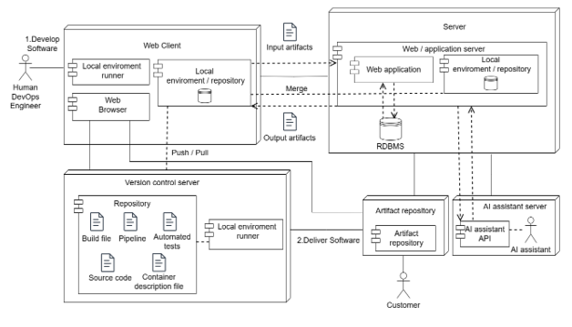
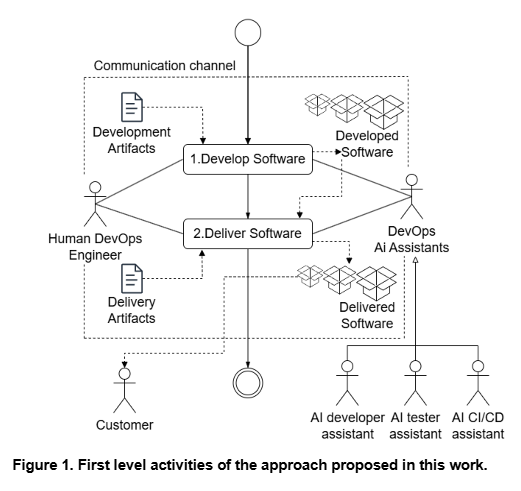
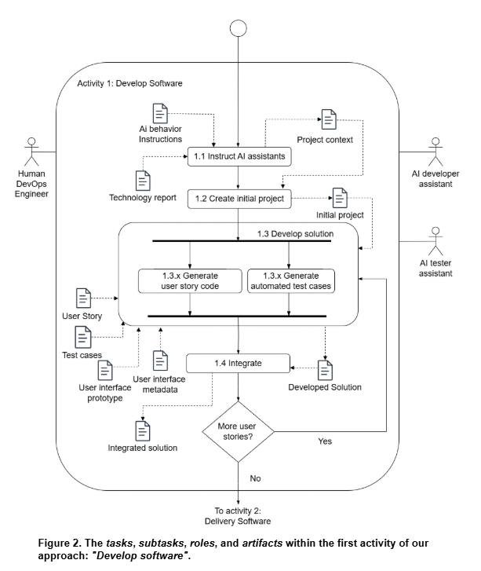
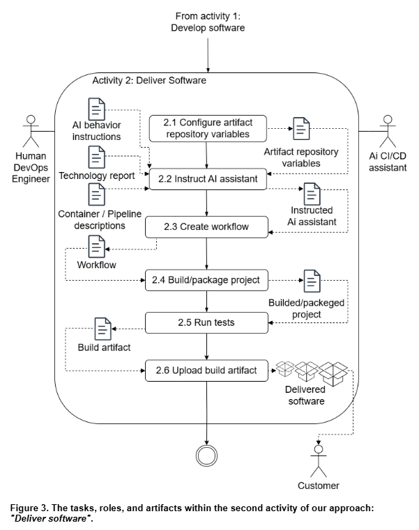

<!DOCTYPE html>
<html lang="PT/BR">
<head>
</head>
<body>
    <h1>DevOpsME</h1>
    <h2>Tabela de Conteúdos</h2>
    <ul>
        <li><a href="#visão-geral-da-arquitetura">Visão Geral da Arquitetura</a></li>
        <li><a href="#approach">Fluxo de Atividades da Abordagem</a></li>
        <li><a href="#configurando-o-assistant">Configurando o Assistant</a></li>
        <li><a href="#como-executar-o-DevOpsME">Como Executar o DevOpsME</a>
            <ul>
                <li><a href="#pré-requisitos">Pré-Requisitos</a></li>
                <li><a href="#executando-a-aplicação-usando-docker">Executando a Aplicação Usando Docker</a></li>
                <li><a href="#executando-a-aplicação-localmente">Executando a Aplicação Localmente</a></li>
            </ul>
        </li>
        <li><a href="#fluxo-de-uso-da-api">Fluxo de Uso da API</a>
            <ul>
                <li><a href="#1-criar-thread">1. Criar Thread</a></li>
                <li><a href="#2-criar-projeto">2. Criar Projeto</a></li>
                <li><a href="#3-adicionar-mensagem-à-thread">3. Adicionar Mensagem à Thread</a></li>
                <li><a href="#4-adicionar-código">4. Adicionar Código</a></li>
                <li><a href="#5-fazer-download-do-projeto">5. Fazer Download do Projeto</a></li>
            </ul>
        </li>
        <li><a href="#endpoints-disponíveis">Endpoints Disponíveis</a>
            <ul>
                <li><a href="#threadcontroller">ThreadController</a></li>
                <li><a href="#projectcontroller">ProjectController</a></li>
                <li><a href="#codecontroller">CodeController</a></li>
                <li><a href="#springclicontroller">SpringCLIController</a></li>
                <li><a href="#githubcontroller">GitHubController</a></li>
                <li><a href="#localgitcontroller">LocalGitController</a></li>
            </ul>
        </li>
        <li><a href="#dependências-do-projeto">Dependências do Projeto</a></li>
        <li><a href="#informações-de-contato">Informações de Contato</a></li>
    </ul>
    <h2 id="visão-geral-da-arquitetura">Visão Geral da Arquitetura</h2>
    <p>O DevOpsME é construído usando Java 17 e o framework Spring Boot. Ele utiliza o Gradle como gerenciador de dependências e inclui várias dependências chave, como Lombok e a API da OpenAI.</p>
    
    <h2 id="approach">Fluxo de Atividades da Abordagem</h2>
    <p>Our approach consists of a workflow of activities, tasks, and subtasks structured into two levels. The first level consists of activities whereas the second level details each first level activity by the use of tasks and subtasks. Within our approach, activities, tasks, and subtasks are performed collaboratively by Human DevOps engineers and AI assistants. Figure 1 presents the first level of our approach. 
	As can be seen in the figure, the Human DevOps Engineer role performs the first activity ("1. Develop Software") in collaboration with DevOps AI assistants (AI Developer assistant and AI tester assistant in this activity), utilizing as input some Development Artifacts</p>
    
    
    
    <p>	The second activity ("2. Deliver Software"), focuses on semi-automating the software delivery process by automating artifact creation and releasing them to a repository while leaving execution on the customer’s machine as a manual step. In this activity, the Human DevOps engineer provides Delivery Artifacts to an AI CI/CD Assistant in order to deliver the software that was developed in the first activity.</p>
    <h3>Tecnologias</h3>
    <div style="display: flex; gap: 7px; flex-wrap: wrap;">
        
        
        
        
        
        
    </div>
    <p><a href="#tabela-de-conteúdos">⬆️ Voltar ao Topo</a></p>
    <h2 id="como-executar-o-DevOpsME">Como Executar o DevOpsME</h2>
    <p>Esta seção fornece um guia sobre como configurar e executar o DevOpsME, seja usando Docker ou localmente.</p>
    <h3 id="pré-requisitos">Pré-Requisitos</h3>
    <p>Para construir e executar a aplicação, você precisará dos seguintes itens:</p>
    <ul>
        <li><strong>Java Development Kit (JDK) 17</strong></li>
        <li><strong>Gradle 8.3</strong></li>
        <li><strong>Docker (se for executar via Docker)</strong></li>
        <li><strong>Chave de API da OpenAI</strong></li>
        <li><strong>Node.js e NPM (para certos recursos)</strong></li>
    </ul>
<h2 id="configurando-o-assistant">Configurando o Assistant pela GUI da OpenAI</h2>
<ol>
  <li>Acesse o site da OpenAI: <a href="https://platform.openai.com/playground/" target="_blank">OpenAI Playground</a></li>
  <li>Na aba lateral, clique em <strong>Assistants</strong>.</li>
  <li>Clique no botão <strong>Create New Assistant</strong>.</li>
  <li>
    Defina o nome do seu assistant. Abaixo do nome será gerado um <strong>ID do assistant</strong>, que será usado para configuração no arquivo <code>.env</code>.
    <br><strong>Exemplo:</strong> <code>asst_HJrsyC7ZLKCJuwT15ygF8JAb</code>
  </li>
  <li>
    No campo <strong>System Instructions</strong>, configure as instruções de comportamento do assistant.
    <br><strong>Exemplo de System Instructions para um assistant de Java:</strong>
    <ul>
      <li><strong>Role:</strong></li>
      <blockquote>
        Você vai atuar como um especialista em criação de projetos Java 17 ou Java 21 com as seguintes tecnologias abaixo. Prioritariamente, você não devolverá texto explicando o procedimento, mas atuará conforme as etapas abaixo:
        <ul>
          <li>Na sua primeira iteração, você devolverá comandos para criação de projeto no terminal, a árvore de diretórios inicial e, posteriormente, atuará recebendo histórias de usuário e critérios de aceitação para produzir código com base neles.</li>
          <li>Quando produzir código, atente-se ao package da classe para ser igual ao package do projeto gerado. Verifique a árvore de diretórios.</li>
          <li>
            Caso utilize dependências não inclusas no projeto base, informe a dependência, sua versão e devolva o arquivo atualizado (<code>build.gradle</code> ou <code>pom.xml</code>).
            <br>Utilize o padrão de regex para as dependências:
            <ul>
              <li><code>gradle</code>: <code>```gradle\n(.+?)\n```</code></li>
              <li><code>maven</code>: <code>```maven\n(.+?)\n```</code></li>
            </ul>
          </li>
          <li>
            Para comandos no terminal, utilize o padrão:
            <ul>
              <li><code>cmd</code>: <code>```cmd\n(.+?)\n```</code></li>
            </ul>
          </li>
          <li>
            Exemplo de criação de projeto Spring Boot usando Spring CLI:
            <br><code>spring init --dependencies=web,lombok --build=gradle --java-version=17 --boot-version=3.2.0 --type=gradle-project --name=centralparkhotel centralparkhotel</code>
          </li>
        </ul>
      </blockquote>
    </ul>
  </li>
  <li>Salve as configurações e copie o <strong>ID do assistant</strong> gerado.</li>
</ol>

<h2>Testando a Configuração</h2>
<ol>
  <li>Utilize as instruções comportamentais configuradas no <strong>System Instructions</strong> para testar a funcionalidade do assistant na interface da OpenAI.</li>
  <li>No <strong>Playground</strong>, selecione o modelo para o assistant.
    <br><strong>Exemplo:</strong> <code>gpt-4-turbo</code>.
  </li>
  <li>Salve o assistant.</li>
</ol>

<h2>Configuração do <code>.env</code></h2>
<p>Crie um arquivo <code>.env</code> na raiz do projeto e adicione os seguintes valores:</p>
<pre><code>OPENAI_API_KEY=sua-chave-de-api
TEST_REACT_ID=asst_g9KCev8WzHY1zJT9cXR2IS0i
TEST_NODE_ID=asst_0hvUbB6SiNxBQBZEzWSAWJHb
PYTHON_ID=asst_ffpgT4f0i3K7Wt35SqOp6uww
REACT_ID=asst_OxHBt8GMEc3x4N8QPqi0wrma
JAVA_ID=asst_P1Mlu6C8nZBevGH0yvX5aK35  # Cole o ID gerado para o assistant configurado para Java
NEXT_ID=asst_WQoe8Myj09wtB3vYWig0FXJb # Caso não use outro assistant, preencha com uma string vazia
NODE_ID=asst_8VMJsRU9b57pgrTVxGMkYb5r
</code></pre>
<p>Agora o assistant está configurado e pronto para uso.</p>
<h3 id="executando-a-aplicação-usando-docker">Executando a Aplicação Usando Docker</h3>
    <h4>1. Clonar o Projeto</h4>
    <pre><code>git clone https://github.com/maximianoneto/DevOpsME.git
    </code></pre>
    <pre><code>./gradlew clean build
    </code></pre>
    <h4>2. Criar um Arquivo <code>.env</code></h4>
    <p>Crie um arquivo <code>.env</code> no diretório raiz do projeto e adicione sua chave de API da OpenAI:</p>
    <pre><code>OPENAI_API_KEY=sua-chave-de-api-openai
    </code></pre>
    <h4>3. Construir a Imagem Docker</h4>
    <p>Navegue até o diretório raiz do projeto e construa a imagem Docker:</p>
    <pre><code>docker build -t dockerfile .
    </code></pre>
    <h4>4. Executar o Container Docker</h4>
    <p>Execute a aplicação usando Docker:</p>
    <pre><code>docker run -p 8081:8081 -p 3306:3306 -e OPENAI_API_KEY="sua-chave-de-api-openai" dockerfile
    </code></pre>
    <h3 id="executando-a-aplicação-localmente">Executando a Aplicação Localmente</h3>
    <h4>1. Clonar o Projeto</h4>
    <pre><code>git clone https://github.com/maximianoneto/DevOpsME.git
    </code></pre>
    <h4>2. Instalar Dependências</h4>
    <p>Certifique-se de que você tem o JDK 17 e o Gradle 8.3 instalados em sua máquina.</p>
    <h4>3. Configurar Variáveis de Ambiente</h4>
    <p>Defina a variável de ambiente <code>OPENAI_API_KEY</code> no seu sistema ou inclua-a na configuração de execução da sua IDE.</p>
    <h4>4. Construir o Projeto</h4>
    <p>Navegue até o diretório do projeto e construa o projeto:</p>
    <pre><code>./gradlew build
    </code></pre>
    <h4>5. Executar a Aplicação</h4>
    <p>Inicie a aplicação:</p>
    <pre><code>./gradlew bootRun
    </code></pre>
    <p><a href="#tabela-de-conteúdos">⬆️ Voltar ao Topo</a></p>
    <h2 id="fluxo-de-uso-da-api">Fluxo de Uso da API</h2>
    <p>Para gerar um projeto e adicionar código dinamicamente, siga a sequência de chamadas de API abaixo. Você pode usar as requisições padrão da documentação Swagger como exemplos.</p>
    <h3 id="1-criar-thread">1. Criar Thread</h3>
    <p><strong>Endpoint:</strong></p>
    <pre><code>POST /thread/createThread
    </code></pre>
    <p><strong>Corpo da Requisição:</strong></p>
    <pre><code>{
    "projectName": "PlazaHotel",
    "programmingLanguage": "java",
    "versionOfProgrammingLanguage": "17",
    "framework": "Spring Boot 3.3.0",
    "dependencyManager": "gradle",
    "additionalDependencies": "lombok"
}
    </code></pre>
    <p><strong>Descrição:</strong></p>
    <p>Este endpoint inicializa uma nova thread para o seu projeto, que será usada para rastrear o contexto da conversa.</p>
    <hr>
    <h3 id="2-criar-projeto">2. Criar Projeto</h3>
    <p><strong>Endpoint:</strong></p>
    <pre><code>POST /project/createProject
    </code></pre>
    <p><strong>Corpo da Requisição:</strong></p>
    <pre><code>{
    "threadId": "thread_s6H8sr4bkz1QTffb0vmS2Yxr",
    "projectName": "PlazaHotel",
    "type": "backend",
    "additionalInformation": "",
    "programmingLanguage": "java"
}
    </code></pre>
    <p><strong>Descrição:</strong></p>
    <p>Cria um novo projeto associado à thread criada anteriormente.</p>
    <hr>
    <h3 id="3-adicionar-mensagem-à-thread">3. Adicionar Mensagem à Thread</h3>
    <p><strong>Endpoint:</strong></p>
    <pre><code>POST /thread/addMessageToThread
    </code></pre>
    <p><strong>Corpo da Requisição:</strong></p>
    <pre><code>{
    "threadId": "thread_c6ed09O5VfaG1MpQ7nY6FGX9",
    "message": "As a booking manager, I want to make a reservation for a customer in a specific period of time so that I do not run the risk of running out of rooms or the desired reservation period",
    "featureDependsBackend": false,
    "projectName": "PlazaHotel"
}
    </code></pre>
    <p><strong>Descrição:</strong></p>
    <p>Adiciona uma nova mensagem à thread, fornecendo instruções adicionais ou histórias de usuário para a geração de código.</p>
    <hr>
    <h3 id="4-adicionar-código">4. Adicionar Código</h3>
    <p><strong>Endpoint:</strong></p>
    <pre><code>POST /addCode
    </code></pre>
    <p><strong>Corpo da Requisição:</strong></p>
    <pre><code>{
    "threadId":"thread_s6H8sr4bkz1QTffb0vmS2Yxr",
    "projectName":"PlazaHotel"
}
    </code></pre>
    <p><strong>Descrição:</strong></p>
    <p>Gera código com base nas mensagens da thread e adiciona ao projeto.</p>
    <hr>
    <h3 id="5-fazer-download-do-projeto">5. Fazer Download do Projeto</h3>
    <p><strong>Endpoint:</strong></p>
    <pre><code>GET /project/downloadProject?projectName=Hostel
    </code></pre>
    <p><strong>Descrição:</strong></p>
    <p>Faz o download do projeto gerado como um arquivo <code>.zip</code>.</p>
    <p><a href="#tabela-de-conteúdos">⬆️ Voltar ao Topo</a></p>
    <h2 id="endpoints-disponíveis">Endpoints Disponíveis</h2>
    <p>Abaixo está uma lista de todos os endpoints disponíveis na aplicação DevOpsME.</p>
    <h3 id="threadcontroller">ThreadController</h3>
    <h4>1. Criar Thread</h4>
    <ul>
        <li><strong>Endpoint:</strong> <code>POST /thread/createThread</code></li>
        <li><strong>Descrição:</strong> Cria uma nova thread com uma mensagem inicial.</li>
        <li><strong>Corpo da Requisição Exemplo:</strong>
            <pre><code>{
    "projectName": "PlazaHotel",
    "programmingLanguage": "java",
    "versionOfProgrammingLanguage": "17",
    "framework": "Spring Boot 3.3.0",
    "dependencyManager": "gradle",
    "additionalDependencies": "lombok"
}
</code></pre>
</li>
</ul>
    <h4>2. Adicionar Mensagem à Thread</h4>
    <ul>
        <li><strong>Endpoint:</strong> <code>POST /thread/addMessageToThread</code></li>
        <li><strong>Descrição:</strong> Adiciona uma mensagem a uma thread existente.</li>
        <li><strong>Corpo da Requisição Exemplo:</strong>
            <pre><code>{
    "threadId": "thread_c6ed09O5VfaG1MpQ7nY6FGX9",
    "message": "As a booking manager, I want to make a reservation for a customer in a specific period of time so that I do not run the risk of running out of rooms or the desired reservation period",
    "featureDependsBackend": false,
    "projectName": "PlazaHotel"
}
</code></pre>
</li>
</ul>
    <h4>3. Obter Mensagens da Thread</h4>
    <ul>
        <li><strong>Endpoint:</strong> <code>GET /thread/getThreadMessages?threadId=thread_wudttBmK8bXWy5tNzP4cNIFh</code></li>
        <li><strong>Descrição:</strong> Recupera todas as mensagens associadas a uma thread.</li>
    </ul>
    <hr>
    <h3 id="projectcontroller">ProjectController</h3>
    <h4>1. Criar Projeto</h4>
    <ul>
        <li><strong>Endpoint:</strong> <code>POST /project/createProject</code></li>
        <li><strong>Descrição:</strong> Cria um novo projeto associado a uma thread.</li>
        <li><strong>Corpo da Requisição Exemplo:</strong>
            <pre><code>{
"threadId": "thread_wudttBmK8bXWy5tNzP4cNIFh",
"projectName": "Hostel",
"type": "web",
"additionalInformation": "Alguma informação",
"programmingLanguage": "java"
}
</code></pre>
</li>
</ul>
    <h4>2. Fazer Download do Projeto</h4>
    <ul>
        <li><strong>Endpoint:</strong> <code>GET /project/downloadProject?projectName=Hostel</code></li>
        <li><strong>Descrição:</strong> Faz o download do projeto especificado como um arquivo <code>.zip</code>.</li>
    </ul>
    <hr>
    <h3 id="codecontroller">CodeController</h3>
    <h4>1. Adicionar Código</h4>
    <ul>
        <li><strong>Endpoint:</strong> <code>POST /addCode</code></li>
        <li><strong>Descrição:</strong> Gera e adiciona código ao projeto com base nas mensagens da thread.</li>
        <li><strong>Corpo da Requisição Exemplo:</strong>
            <pre><code>{
    "threadId":"thread_s6H8sr4bkz1QTffb0vmS2Yxr",
    "projectName":"PlazaHotel"
}
</code></pre>
</li>
</ul>
    <h4>2. Analisar Protótipo</h4>
    <ul>
        <li><strong>Endpoint:</strong> <code>POST /analyze</code></li>
        <li><strong>Descrição:</strong> Analisa uma imagem de protótipo de baixa fidelidade e gera o código correspondente.</li>
        <li><strong>Exemplo de Form Data:</strong>
            <pre><code>imageFile: (arquivo binário)
message: "Gere o código em html, css, javascript"
</code></pre>
</li>
</ul>
    <hr>
    <h3 id="springclicontroller">SpringCLIController</h3>
    <h4>Obter Dependências do Spring</h4>
    <ul>
        <li><strong>Endpoint:</strong> <code>GET /spring/dependencies</code></li>
        <li><strong>Descrição:</strong> Recupera a lista de dependências atualizadas do Spring.</li>
    </ul>
    <p><em>Nota:</em> Para que este endpoint funcione corretamente, o Spring CLI deve estar instalado em seu sistema.</p>
    <hr>
    <h3 id="githubcontroller">GitHubController</h3>
    <h4>Criar Repositório no GitHub</h4>
    <ul>
        <li><strong>Endpoint:</strong> <code>POST /github/repository</code></li>
        <li><strong>Descrição:</strong> Cria um novo repositório no GitHub e faz commit dos arquivos do projeto.</li>
        <li><strong>Corpo da Requisição Exemplo:</strong>
            <pre><code>{
"projectName": "MyNewProject",
"projectDescription": "Este é um novo projeto criado via API"
}
</code></pre>
</li>
</ul>
    <hr>
    <h3 id="localgitcontroller">LocalGitController</h3>
    <h4>1. Inicializar Repositório Git Local</h4>
    <ul>
        <li><strong>Endpoint:</strong> <code>POST /git/initialize</code></li>
        <li><strong>Descrição:</strong> Inicializa um repositório Git local para o projeto.</li>
        <li><strong>Parâmetros de Query:</strong>
            <ul>
                <li><code>projectName</code>: Nome do projeto.</li>
            </ul>
        </li>
    </ul>
    <h4>2. Comitar Alterações</h4>
    <ul>
        <li><strong>Endpoint:</strong> <code>POST /git/commit</code></li>
        <li><strong>Descrição:</strong> Comita alterações no repositório Git local.</li>
        <li><strong>Parâmetros de Query:</strong>
            <ul>
                <li><code>projectName</code>: Nome do projeto.</li>
                <li><code>commitMessage</code>: Mensagem do commit.</li>
            </ul>
        </li>
    </ul>
    <h4>3. Reverter para Commit Anterior</h4>
    <ul>
        <li><strong>Endpoint:</strong> <code>POST /git/rollback</code></li>
        <li><strong>Descrição:</strong> Reverte o repositório Git local para um commit anterior.</li>
        <li><strong>Parâmetros de Query:</strong>
            <ul>
                <li><code>projectName</code>: Nome do projeto.</li>
                <li><code>commitId</code>: ID do commit para o qual reverter.</li>
            </ul>
        </li>
    </ul>
    <p><a href="#tabela-de-conteúdos">⬆️ Voltar ao Topo</a></p>
    <h2 id="dependências-do-projeto">Dependências do Projeto</h2>
    <p>Abaixo estão as principais dependências utilizadas no projeto DevOpsME:</p>
    <ul>
        <li><strong>Spring Boot Starter Web</strong></li>
        <li><strong>Spring Boot Starter Data JPA</strong></li>
        <li><strong>Spring Boot Starter Security</strong></li>
        <li><strong>Springdoc OpenAPI UI</strong></li>
        <li><strong>Lombok</strong></li>
        <li><strong>Cliente da API OpenAI</strong></li>
        <li><strong>Conector MySQL</strong></li>
        <li><strong>Docker</strong></li>
    </ul>
    <p><strong>Exemplo do <code>build.gradle</code>:</strong></p>
    <p><a href="#tabela-de-conteúdos">⬆️ Voltar ao Topo</a></p>
    <h2 id="informações-de-contato">Informações de Contato</h2>
    <p>Para quaisquer dúvidas ou suporte, por favor, entre em contato:</p>
    <p><strong>Maximiano Cid Neto</strong></p>
    <p>Email: <a href="mailto:maximiano.neto@sou.unifal-mg.edu.br">maximiano.neto@sou.unifal-mg.edu.br</a></p>
    <p><strong>Carlos Henrique Arantes</strong></p>
    <p>Email: <a href="mailto:carlos.arantes@sou.unifal-mg.edu.br">carlos.arantes@sou.unifal-mg.edu.br</a></p>
    <p><a href="#tabela-de-conteúdos">⬆️ Voltar ao Topo</a></p>
</body>
</html>
